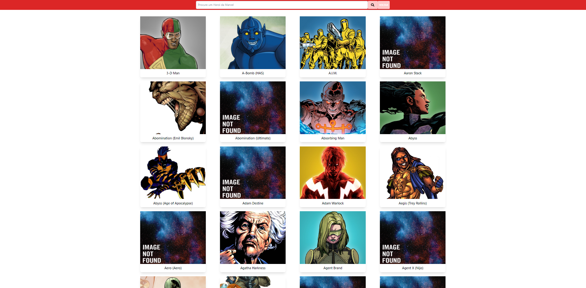
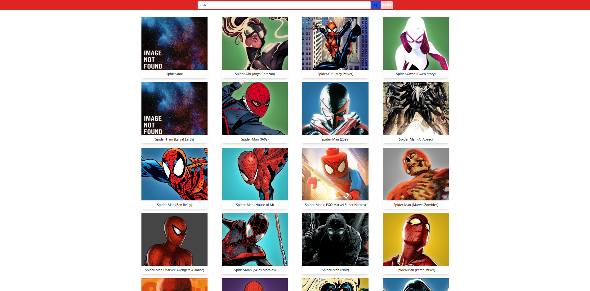
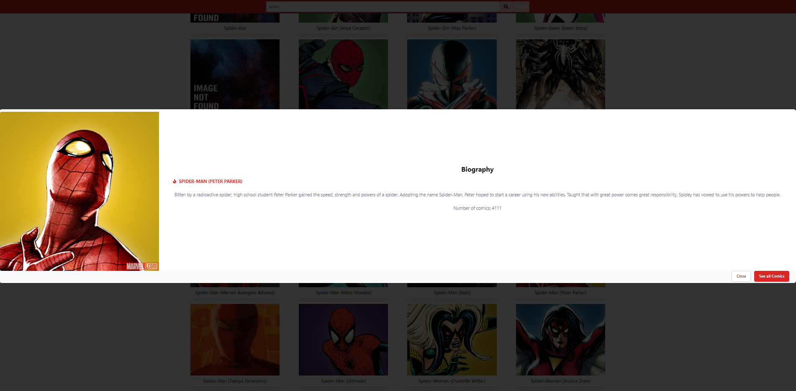
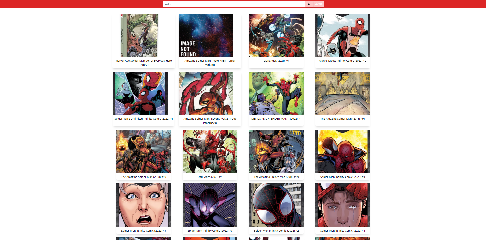
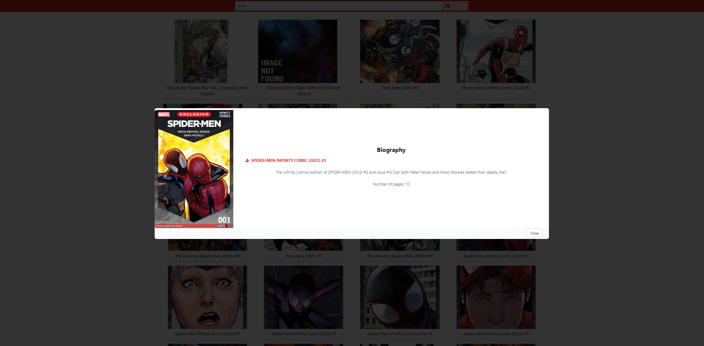

# MARVEL API

# Sobre o projeto

Aplicação que utiliza a api da marvel para pesquisar heróis e quadrinhos

## Imagens da aplicação

### menu



### pesquisa do herói



### biografia 



### quadrinhos herói



### informação quadrinho



# 🚀 Começando

Essas instruções permitirão que você obtenha uma cópia do projeto em operação na sua máquina local para fins de desenvolvimento e teste.

## 📋 Pré-requisitos

- npm / yarn

## 🔧 Instalação
### :warning::warning: **A pasta imgs**: é para guardar as imagens usadas no readme.md! Apagar ela depois do clone :warning::warning:
``` bash
### clonar repositório
git clone https://github.com/PauloCSantos/marvelapi.git

## entrar na pasta do projeto
cd marvelapi

## instalar as dependencias
npm install

## gerar as chaves(public e private)
acessar o site da marvel https://developer.marvel.com/ e realizar o cadastro para obter as chaves

## preencher o api.js na pasta services
na pasta services preencher o publickey e privatekey com as chaves geradas no site da marvel

## executar o projeto
npm start
```

## 🛠️ Construído com

- ReactJS
- TailWindCSS

## ✒️ Autor

* **Paulo C Santos** - [Linkedin](https://www.linkedin.com/in/paulocsantos1995/)

## 🖐️ Agradecimento

Agradeço a Marvel pela Api 

-Link da api da Marvel: https://developer.marvel.com/
